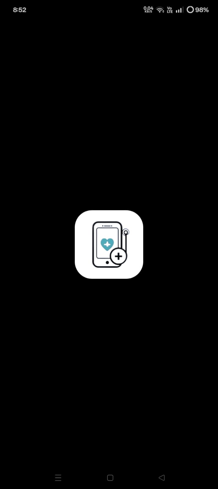

# 🩺 Sehat Sathi — Your Personal Health Companion

Sehat Sathi is a mobile app built using Flutter to help users monitor, manage and improve their everyday health. It empowers individuals with tools to track symptoms, maintain medical records, set reminders, and access reliable health information whenever needed.

 

## 🌟 Vision
To make healthcare guidance accessible, organized and effortless for everyone — especially non-tech users, senior citizens & families.

 

## ✨ Key Features

- 🩹 Daily health status tracking
- 📊 Symptom history dashboard
- 💊 Medicine reminders
- 📁 Store medical prescriptions & reports
- 🧑‍⚕️ Doctor contact directory
- ⚠️ Emergency help section
- 📚 Health tips & awareness info
- 👤 Profile & settings

*(modify based on your real features)*

 

## 🛠 Tech Stack

**Frontend**
- Flutter
- Dart

**Backend**
- Supabase / Firebase  
*(depending on what you used)*

**Integrations**
- Local notifications / reminders
- Cloud storage
- Secure Auth

 

## 📷 UI Screenshots

(place screenshots in `/screenshots` folder)

| Home | Health Log | Reminders |
|------|-------------|-----------|
|  |  |  |

 

## 🎥 App Demo

(Add link after upload)

